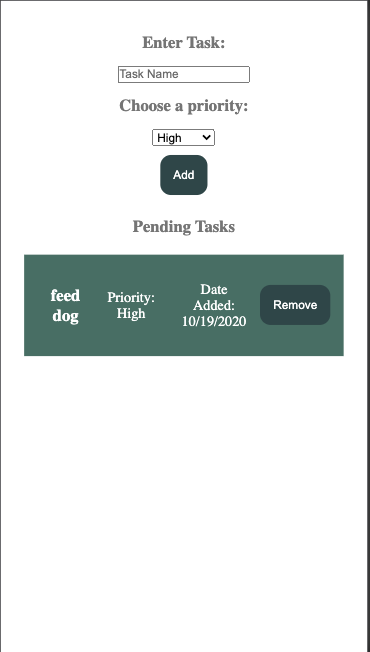
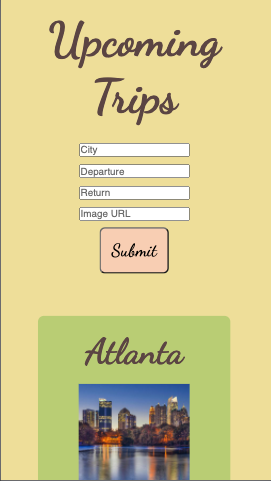
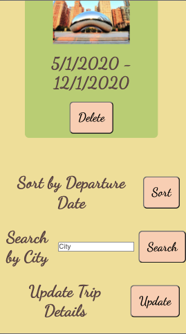
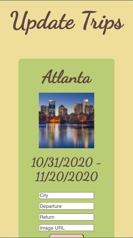
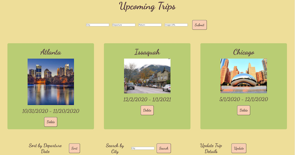
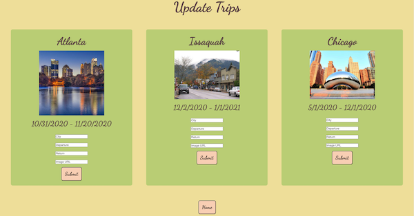

<h1> Week 7 and 8 DigitalCrafts Full-Stack Immersive </h1>

 - Coursework on Node, Express, Server side pages, Sockets, SQL, CRUD, and Sequelize ORM. It contains assignments, files, and 
  screenshots from week 7 and week 8.  

<h2> Summary </h2>

  - [Screenshots](#screenshots)
  - [Acknowledgments](#acknowledgments)

## Screenshots

**Week 7 Day 1 - To Do List App**

- Prompt was to build your own API using Node and Express. The app should be able to display all To Do items (title, priority and date created), save new To Do items, and have a UI. I did the additional hard mode option of deleting existing items.

**Week 7 Day 2 - Trip App**

- Prompt was to build a website for tracking trips with server side pages using Mustache. Users have the ability to view all trips, add a new trip, and delte a trip. I did the additional hard mode options: update the trip, sort trips by date, and search for a trip by destination city.

